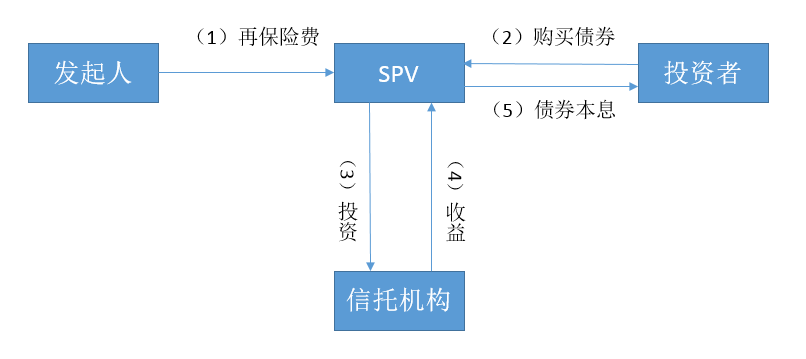

## About DNF: Disaster Financing Network
 
### Background
In the past half century, the occurrence of catastrophes in the world has increased exponentially in terms of both the number of times and the amount of losses. The disaster with a small probability and a huge loss undoubtedly has an important influence on the national economy. According to statistics, the economic losses caused by the disaster have been close to five thousandths of the world's gross national product.

### Key

From a worldwide perspective, although the nature of the disaster and the location of the disaster vary from year to year, the total amount of loss and the total amount of government disaster relief is a stable large amount, but still can not meet the needs of disaster relief and recovery of production. It needs to be supplemented by private fund-raising or cross-border institutional contributions. Drawing on economic means such as bond financing in the financial industry, it is the design background of this project to support the government or regional institutions to introduce market mechanisms in disaster relief through the construction of convenient technology platforms, and to ensure the financial support required for disaster recovery through a series of financing means such as securitization.

### Introduce

The main purpose of the project is to build a multi-subject disaster financing network for cross-border and cross-regional, which is composed of institutions that undertake the relevant functional division of labor, and can provide individual users with relevant data-based query and public-facing authorized information release sharing function.

Disaster financing network can be based on volcanic, earthquake, tsunami and other catastrophic events to support related asset injection, bond issuance, financial leasing, special purpose institutions (SPV) generation, asset package securitization and reinsurance and other complex financial assets operation. 

In the financing of disaster prevention and disaster reconstruction, the use of financial instruments on the basis of sovereign disaster relief assets or private fund-raising to carry out adequate resource integration and effective use of funds. The project builds a hybrid account book of multi-subject disaster relief assets injection and private fund-raising bonds across borders and regions through distributed ledger technology supported by blockchain technology. Build a trusted financing collaboration network across borders and regions based on multi-body collaboration engine technology based on smart contracts.Take advantage of technical features such as blockchain technology transparency, mutual trust, traceability, and distributed certificates.

### Flow Chart

Typical scenario application process：




### Value

Any relevant region or organization may use this project to raise funds, manage and refinance more complex assets during the disaster prevention and disaster reconstruction phase, securitization of assets and reinsurance.

### Roadmap

The project is currently based primarily on the Fabric project in IBM's Hyper Ledger; User management and authentication part of the Bank of Communications self-research authentication platform implementation. In the future, complex scenarios such as leases and transactions based on blockchain-based financing targets can be considered in practice, and further functional design for the disclosure of financing asset information can be carried out on an ongoing basis.

---

**Attention**: The API documents and codes are written in Chinese.

## Hyperledger Fabric 基础知识和例子

Hyperledger Fabric 官方文档请参见[这里](https://hyperledger-fabric.readthedocs.io/en/release/)。

Hyperledger Fabric 例子请参见[这里](https://github.com/hyperledger/fabric-samples)。

## 关于安装 chaincode

可以在test目录中简单运行以下命令安装chaincode

````
node install_chaincode.js
````

使用``cli``安装时，请将``src``目录放在``peer``节点的``GOPATH``目录下。

使用[Node.js SDK](https://github.com/hyperledger/fabric-sdk-node)安装时，请注意指定``process.env.GOPATH``路径为``src``的父目录。

## 关于升级 chaincode

升级chaincode请按照如下步骤进行：

1. 重新指定``install_chaincode.js``中chaincode的版本号``chaincode_ver``
2. 执行``node install_chaincode.js``安装chaincode
3. 执行``node upgrade_chaincode.js``升级chaincode

成功后，执行``docker ps``命令，可看到升级前后的两个chaincode均在运行。

## 关于测试 chaincode

可以通过以下简单的方法测试chaincode是否可正常install、instantiate以及调用逻辑。

1. 安装[Hyperledger Fabric Samples](http://hyperledger-fabric.readthedocs.io/en/latest/samples.html)项目
2. 启动[Hyperledger Fabric Samples](http://hyperledger-fabric.readthedocs.io/en/latest/samples.html)项目的``basic-network``
3. 到``test``目录中执行命令
````
npm install
````
4. 模块安装完成后，使用node命令执行``test``目录中的测试脚本

## 关于移除 chaincode 容器和镜像

1. 执行``docker ps -a``，找到需要删除的chaincode容器ID``CONTAINER ID``，一般容器对应的IMAGE名称形如``dev-peer0.org1.example.com-test_abs_ledger-v0.0.1-9e60b9a5b79bd167dce10ae0550d0761dfaec438b76b117c837eee4bec3cb7f2``
2. 执行``docker rm ${CONTAINER ID}``来删除容器，``${CONTAINER ID}``为第1步找到的``CONTAINER ID``
3. 执行``docker images``，找到需要删除的镜像ID``IMAGE ID``
4. 执行``docker rmi ${IMAGE ID}``删除镜像

## API

调用chaincode的方法、参数和详细说明，请参见[API文档](./docs/README.md)。

## 修改代码的说明

### dfn.go

``dfn.go``主要作用是实现``Chaincode``接口，包含：
- Init
- Invoke

二次开发添加新的``Invoke``方法后，注意添加到``dfn.go``中去。

[API文档](https://github.com/hyperledger/fabric/blob/release/core/chaincode/shim/interfaces.go#L28)

### read_ledger.go

``dfn.go``主要提供以下能力：
- **read**: 通过``key``获取资产的能力
- **get_history**: 通过``key``获取资产历史的能力

### lib.go

``lib.go``为工具文件，提供以下能力：
- **GetAllObjectsByDocType**: 通过传入分页参数和DocType分页查询某个种类的资产全部内容
- **GetQueryResult**: 使用``stub.GetQueryResult``接口查询并转换结果为[]byte
- **ConvQueryResult**: 将查询结果类型`` shim.StateQueryIteratorInterface``转换为[]byte
- **ConvHistoryResult**: 将查询结果``shim.HistoryQueryIteratorInterface``转换为[]byte
- **UpdateStruct**: 传入需要更新的Struct的指针，以及需要更新的字段名``key``（首字母可以为小写）和值``value``，更新结构体。如果出现Struct定义以外的字段名或字段是受保护的字段（如id）等情况，将会返回非``nil``的``error``
- **SanitizePagingArgument**: 检查并返回分页参数，如果参数有误，将会返回非``nil``的``error``

### project.go

定义智能合约中的资产信息结构，以及对资产操作的方法。

### workflow.go

定义智能合约中的工作流，以及对工作流定义操作的方法。

### process.go

定义智能合约中的工作流流程实例，以及对流程实例操作的方法。

### rsa.go

``rsa.go``提供RSA加密存储工具，可直接使用``encrypt_data``和``decrypt_data``方法测试/执行加解密操作，也可使用`rsa.go`提供的工具为自己的chaincode方法提供加解密支持。

详见[API文档](./docs/rsa_API.md)。
